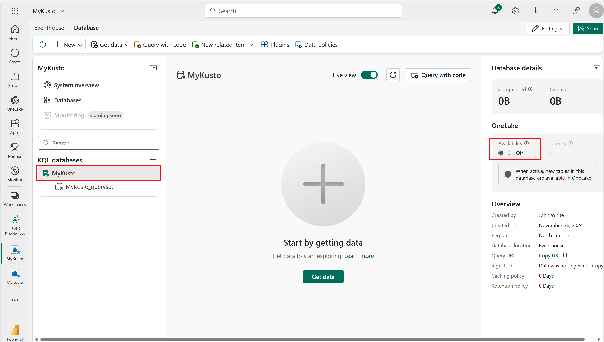
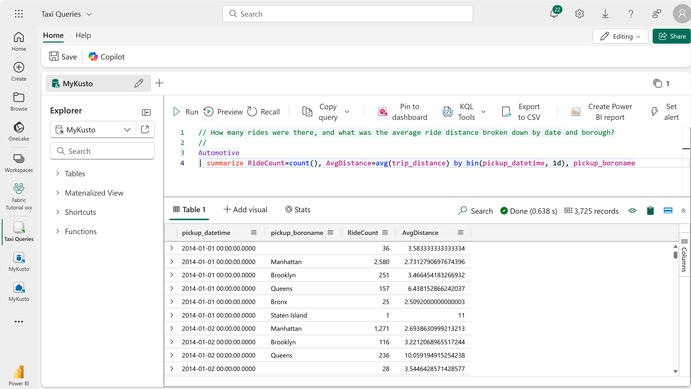
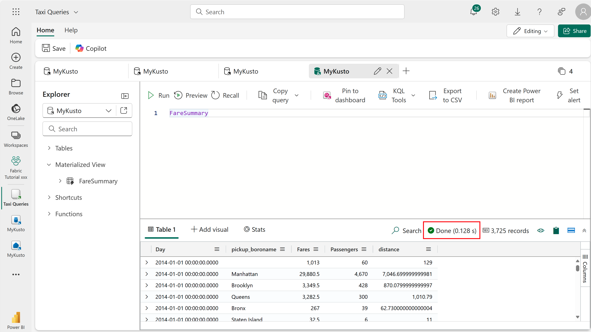
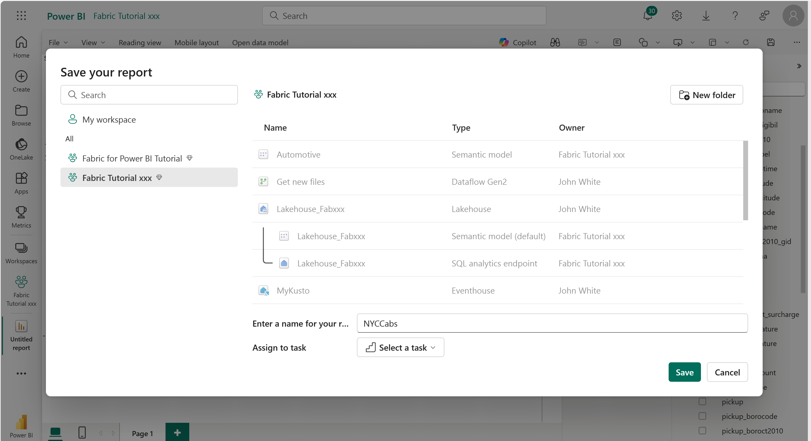

# Real-time Intelligence with Eventhouse

## Add a new Eventhouse and ingest data

Navigate to the "Fabric Tutorial xxx" workspace and click the "+ New item" button from the ribbon. Scroll down to the "Store data" section and select the "Eventhouse" tile. MyKusto

Name the eventhouse "MyKusto" and click the "Create" button. Once it is created, click on the "MyKusto" database in the KQL databases section of the window.



We want our data to be available in OneLake, but that option is off by default. To turn it on, select the option under "Availability" on the right side in the Database details pane.

Add some sample data. Click on the "Get data" button, select "Sample" then select "Automotive operations analytics". This is a truncated database of New York taxi operations over a two year period, and the largest provided sample data set. This will take a few moments to load.

Expand the "Automotive" table to view the schema.

Click the "Query with code" button in the ribbon, then select "Show any 100 records". A queryset window will open with the correct query. Click on "run" and note the time it takes.


Replace "take 100" in the query window with "count" and run the query. You should see that there are over 2 million records in the table.

## Create a Query Set for multiple sharable queries

The data explorer is handy, but if you're working extensively with KQL, you will likely want to use a purpose built client like Azure Data Studio or Visual Studio Code or the Azure Data Explorer client. Within Fabric, the KQL Queryset is a sharable version of the Azure Data Explorer client.

Navigate back to the workspace. Click the "+ New item" button in the ribbon, scroll down to the "Track data" section, and select the KQL Queryset tile. Name it "Taxi Queries" and click "Create".


Select the"MyKusto" database created above, and click "Connect".

Delete the queries automatically added to the default tab. Note that you can add tabs to work with different queries efficiently, and when saved, others can work with this query set.

Click the Copilot button, and enter the following prompt: "*How many rides were there, broken down by date and borough?*"

Copilot should respond with the following query:

```PlainText
Automotive | summarize RideCount=count(), AvgDistance=avg(trip_distance) by bin(pickup_datetime, 1d), pickup_boroname
```

Click the "Insert" button below the response. Feel free to close the Copilot window. The query summarizes fares, passengers, and distances by borough name. Click on the "Run" button to run the query, and note the time required to run in the results window. It should be around 1 second.



## Build a materialized view

While running a summarized query against 3 million rows of data in under a second is good, more complex queries with elements like joins, etc, and larger amounts of data can present a performance challenge. If these query patterns are common, it is a good idea to build a materialized view.

While still in the queryset, add a new tab and add in the following code:

```PlainText
.create async materialized-view with(backfill = true) FareSummary on table Automotive { 
Automotive
| summarize Fares = sum(fare_amount), Passengers = sum(passenger_count), distance = sum(trip_distance) by Day = bin(pickup_datetime,1d), pickup_boroname
}
```

The "async" directive tells Fabric to process this command in the background, which is necessary to use the "backfill=true" option. Backfill tells Fabric to include all current data in the materialized view - without it, the view will only contain new data after it is run. Click on the "Run" button in the ribbon. The result will be an OperationId. This Id can be used to query the status of the operation.

Wait a few seconds and then refresh your browser window. Open the "Materialized View" node and you should see the new "FareSummary" view. Open the "FareSummary" Materialized view to see the schema.


Open a new tab, and simply enter the name of the view by double clicking on it in the explorer view. Click on the "Run" button. The first run is initialization, so run it a second time. It should run in less than half the time that the original query ran. Also note the number of rows returned.



## Create a Shortcut

Navigate back to your Fabric Tutorial XXX workspace and open your Lakehouse_FabXXX lakehouse. Click the "Get data" button in the riibbon, and then select "New shortcut". Select "Microsoft OneLake", and finally your "MyKusto" database.


Click Next, then open the "Tables" node and select the "Automotive" table. Click "Next", and on the following screen, "Create". A shortcut is created in the Lakehouse that points to the data from the MyKusto data. We can use that data in a new semantic model and build a report on it. Click the "New semantic model" button from the ribbon. Give it the name "Automotive", then open the schema tree and select the "Automotive" table. Once added, click "Confirm".

*Note: if the Automotive table doesn't appear as an option, open up the SQL Analytics endpoint for the Lakehouse, and wait for it to be added, then try again.*


## Build a Power BI report

From the semantic model, click on the "New report" button.

Close the filter pane, and add a stacked bar chart to the canvas. You may want to resize the chart to make it easier to see.

Add "pickup_boroname" to the Y-axis, and "fare_amount" to the X-axis.

Select the save icon in the ribbon and name the report NYCCabs. Select the "Fabric Tutorial xxx" workspace and click "Save". Close the Power BI window.



Navigate back to the "Fabric Tutorial xxx" workspace. Note that there is both a report "NYCCabs" and a semantic model "Automotive"created. Click on the "Automotive" semantic model.

Click the "Open data model" button in the ribbon.

From the ribbon, click the "New measure" button.

Enter the following in the editor:

```PlainText
Trips = COUNTROWS('Automotive')
```

Click "Enter" and make sure the new "Trips" measure appears in the Data section.


Navigate back to the workspace, and click on the NYCCabs report.

Click "Edit" in the ribbon. Add a new card visual to the report, and add the new "Trips" measure to its Fields.


Save the report and navigate back to the workspace.

## Create an event stream and output to KQL and Lakehouse

Navigate to the "Fabric Tutorial xxx" workspace and click the "+ New item" button from the ribbon. Scroll down to the "Real-Time Intelligence" section and select the "Eventstream" tile.

Name your Eventstream "BikesFeed". Click the "Create" button. It make take a few seconds for the screen to load.


Click on "New source" and select "Sample data". (This is a selection of sample data feeds provided by Microsoft for testing).

Name the source "Rental_Bikes" and select "Bicycles (Reflex compatible)" from the dropdown menu. Click the "Add" button.

Click on the "BikesFeed" tile in the middle and observe the Data preview. It may take a few moments to load.


Click on the "New destination" tile and select "KQL Database".

Select "Event processing before ingestion", and the following configuration options.

* Destination name: BikesSummary
* Workspace: Fabric Tutorial xxx
* KQL Database: MyKusto
* Destination table: Select the "Create New" link. Name the new table "BikesSummary".
* Input data format: Json


Click the "Open event processor" button at the bottom.

Select the line connecting the BikesFeed and KQLDatabase1    boxes and delete it.

From the ribbon, press the "Operations" button, and select "Group by".

Connect the "BikesFeed" source to the Group by action, and that action to the "KQLDatabase1" destination. You may need to zoom out to see all three boxes.


Click on the "Groupby1" action. Select the Average aggregation for the "No_Bikes" field, and click the "Add" button. Click on "+ Add aggregate function" and create another Average for the No_Empty_Docks" field.

Scroll down to the Settings section and select the "Neighbourhood" field to group the aggregations. Leave the time window as "Tumbling", and set the duration to 1 minute. Click the "Done" button in the "Group by" pane, and then "Done" in the editor window.


Finally, click the "Add" at the bottom. The destination table will be created, and data will begin flowing to it. Click on the "BikesSummary" node to see a preview of the streaming grouped data.

Click the "+" button to the right of the "BikesFeed" node. Select "Lakehouse" and fill in the following values:

* Destination name: BikesLive
* Workspace: Fabric Tutorial xxx
* Lakehouse: Lakehouse_Fabxxx
* Delta table: Select the "Create New" link. Name the new table "BikesLive".
* Input data format: Json


We will not process these events, so click on the "Add" button. The delta table will be created, and data will begin flowing.


## Build a Power BI report from the lakehouse

Navigate back to the "Fabric Tutorial xxx" workspace, and open the "Lakehouse_Fabxxx" lakehouse. Click the "BikesLive" table to see a preview of the data. Note that it make take a couple minutes for the table to appear.


Change from "Lakehouse" to "SQL analytics endpoint" with the button in the upper right of the ribbon. Select the "BikesLive" table again. Hover over the "BikesLive" node, click the ellipsis, and select "Add to default semantic model". If you receive an error, repeat the process.

Click the "New measure" button in the Reporting tab of the ribbon. Add the following measure:

```PlainText
Latest (UTC) = MAX(BikesLive[EventProcessedUtcTime])
```

Select the "Model" tab at the bottom of the Explorer pane. Find the "BikesLive" table and click on the "Latest (UTC)" measure.

Change the value for "Format" to "Custom" and add the following Custom format in the box below:

```PlainText
yyyy-MM-dd hh:mm:ss
```


Click the "New report" button on the ribbon.

Open the "BikesLive" table in the "Data" pane on the right.

Add a new Card visual to the report canvas, and add the ***Latest (UTC)*** measure to it.

Add a table to the canvas, and add the following fields: EventProcessedUTCTime, Neighbourhood, No_Bikes, No_Empty_Docks

Change the Aggregation for No_Bikes and No_Empty_Docks to Average by using the dropdowns in the Visualizations pane. Click on the "EventProcessedUTCTime" column twice to sort it in reverse order.


Refresh the report from the upper right corner of the ribbon. Note that the latest readings have (likely) changed.

Save the report, and name it "Bikes report in real time". Note that any time it is opened, it will display up to date data with no refresh.
